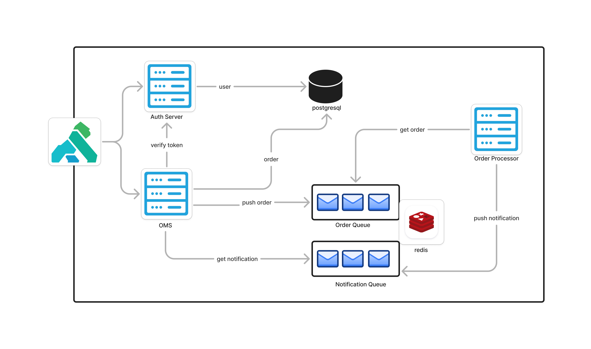

# oms
## run
### install redis
```shell
helm repo add bitnami https://charts.bitnami.com/bitnami
helm repo update
helm install redis -n oms bitnami/redis --set auth.enabled=false
```
### install oms chart
* Clone this GitHub repository
* run the following helm command to oms system
    ```shell
    helm upgrade -i oms ./installer -n oms
    ```
### create postgres tables
```shell
#exec in postgres database pod
kubectl exec -it -n oms oms-postgres-586957879f-b92vt bash

#open psql console
psql -U postgres -d oms

#user table
CREATE TABLE users (
    id SERIAL PRIMARY KEY,
    username VARCHAR(50),
    email VARCHAR(100),
    password VARCHAR(100)
);
#order table
CREATE TABLE orders (
    id SERIAL PRIMARY KEY,
    username VARCHAR(50),
    description VARCHAR(100)
);
```

### install kong
```shell
helm repo add kong https://charts.konghq.com
helm repo update
helm install kong kong/ingress -n oms --create-namespace --set gateway.image.repository=kong --set gateway.image.tag="3.8.0"

#port forward gateway proxy to use it locally 
kubectl port-forward -n oms service/kong-gateway-proxy 8000:80
```

### uninstall
* uninstall redis
  ```shell
  helm uninstall -n oms redis
  ```
* uninstall kong proxy server
  ```shell
  helm uninstall -n oms kong
  ```
* uninstall oms chart
  ```shell
  helm uninstall oms -n oms
  ```
## design


## Auth Server
Auth Server will provide you user authentication related information, such as: 
* create user
* list users
* get token

### create new user
`/auth/users [POST]` api endpoint will create a new user. 

Example:
```shell
curl -H 'Content-Type: application/json' \
-d '{ "username":"rasel","password":"1234"}' \
-X POST \
localhost:8000/auth/users
```
### get users
`/auth/users [GET]` api endpoint will get the list of users.

Example:
```shell
curl localhost:8000/auth/users
```

## Order Management Server

### create new user
`/product/order [POST]` api endpoint will create a new order. It will push the order in a queue and instantly return the created response.

```shell
curl -H 'Content-Type: application/json' \
-d '{ "username":"rasel","password":"1234"}' \
-X POST \
localhost:8000/product/order
```
### get order list
`/product/orders [GET]` wil return the list of the orders.
Example:
```shell
curl localhost:8000/product/orders
```

## Order and Notification Queue
* Order Queue
* Notification Queue

Used [Asynq](https://github.com/hibiken/asynq) to maintain the distributed queues. Order Queue will maintain the orders which needs to be served. 
Notification Queue have the order ready notification. So that user can be notified when the order is ready.

**_Asynq_** uses redis to maintain the queue.

## Order Processor
It's an independent server which will fetch orders from **_Order Queue_** and process them. Once it processes an order it will push 
a notification to the **_Notification Queue_**. 